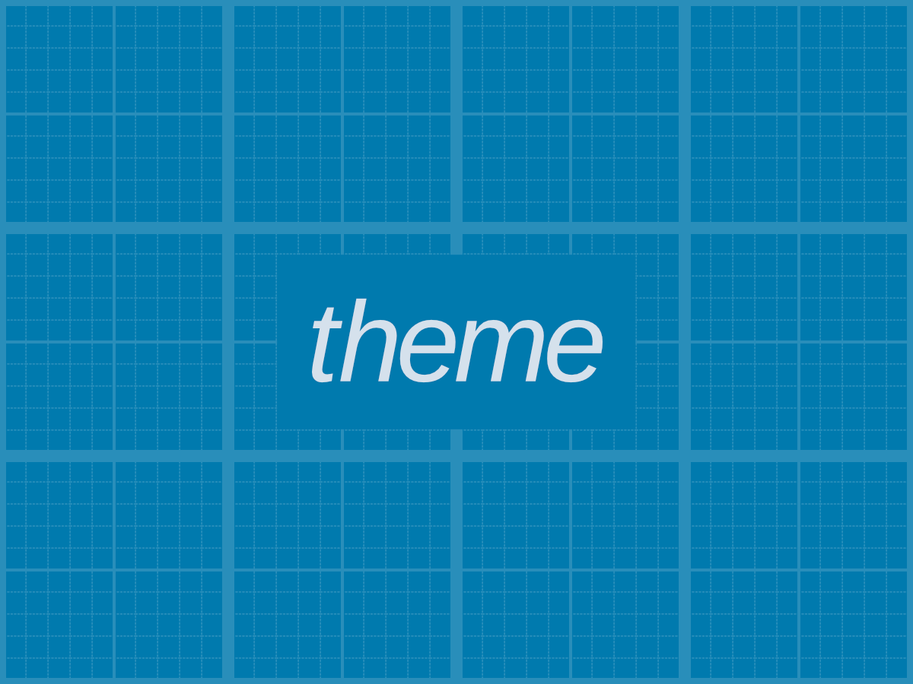

# Theme – My WordPress starter theme

A tiny WordPress starter theme.

Now extremely lightweight and oriented to Gutenberg.

##### Child theme here: https://github.com/loltgt/theme-codename

#### Documentation

Read the documentation here: https://github.com/loltgt/theme/wiki

#### Requirements

* WordPress >= 5
* PHP >= 7
* Node.js

### How to contribute

You can open issues to report bug, request features or send a Pull Request.

### License

[GPL-2.0-or-later](LICENSE)

Some contents in "src" folder are dual licensed (MIT OR GPL-2.0-or-later).
